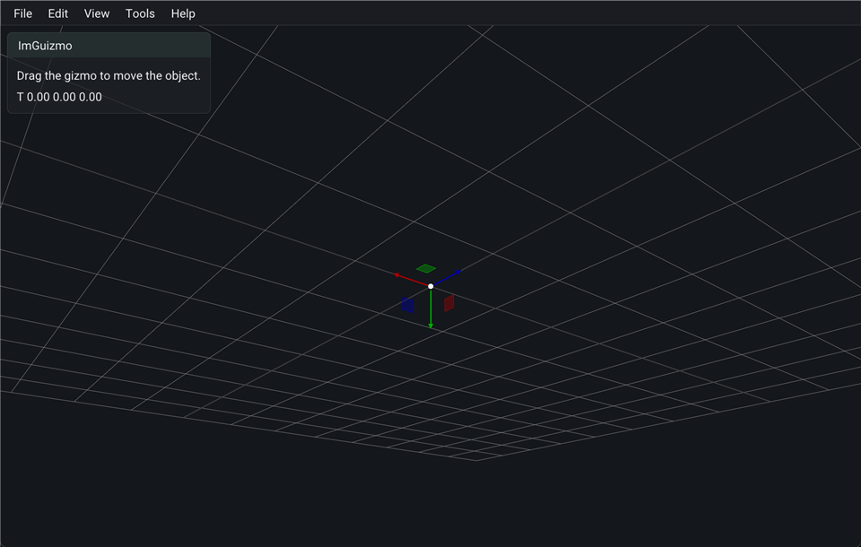

# example_ImGuizmo



Translate gizmo over the clear color via `Mui::setGizmoDrawer` (runs inside the ImGui frame). Drag the axes; the HUD shows translation.

```bash
cmake -S . -B build
cmake --build build --target example_ImGuizmo
./build/bin/example_ImGuizmo
```
