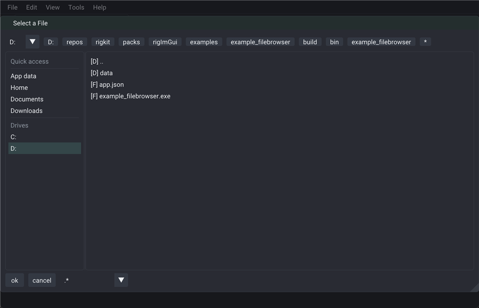

# example_filebrowser



`Mui::openFileDialog` (imgui-filebrowser) - opens on launch; **Open Dialog** again from the demo panel.

ImGui for this demo lives in an `IWindow` (inside `Mui::render` after `NewFrame`), not in `IApp::draw()`.

```bash
cmake -S . -B build
cmake --build build --target example_filebrowser
./build/bin/example_filebrowser
```
