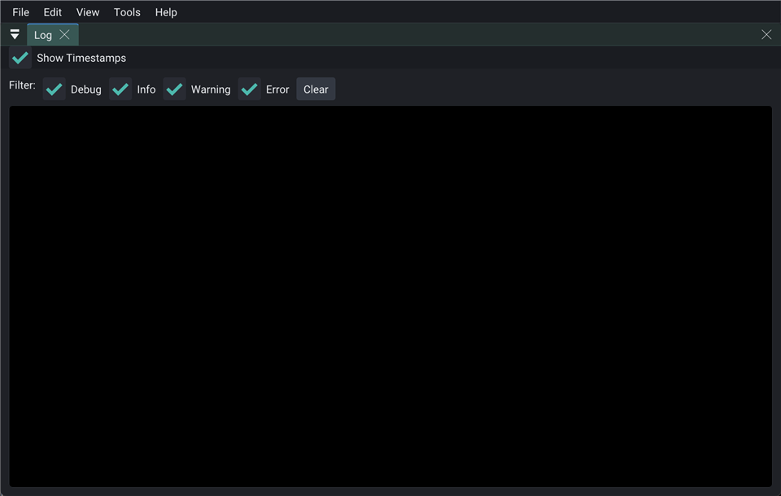

# sample_menubar



Host menu bar (File / Edit / View / Tools / Help) with a docked **Log** panel.

```bash
cmake -S . -B build
cmake --build build --target sample_menubar
./build/bin/sample_menubar
```
